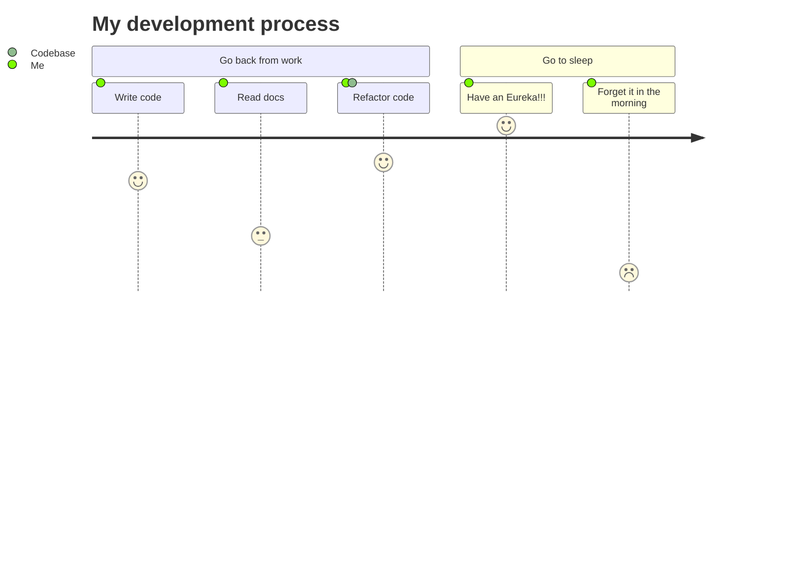

# Wordle Wordwide

Wordle Wordwide is a personal project which amplifies the fun and attractiveness of Wordle by providing more languges to choose from. 

## Educational Attentions
- Self teaching `GO` programming language
    1. The idea behind `GO` 
    2. Basic Syntax 
    3. Types & Interfaces
    4. Error handaling
    5. Context & Chanels
    6. Unit testing
    7. Common packages
- Setting up a http server with go
- Getting to know `Bun`
- Having fun coding from scratch :)

## Installation

Use the package manager [pip](https://pip.pypa.io/en/stable/) to install foobar.

Front
```bash
cd Frontend
bun install
bun dev
```

Back
```bash
cd ApiServer
go run .
```

## Journey



## Contributing

Pull requests are welcome. For major changes, please open an issue first
to discuss what you would like to change.

Please make sure to update tests as appropriate.

## License

[MIT](https://choosealicense.com/licenses/mit/)